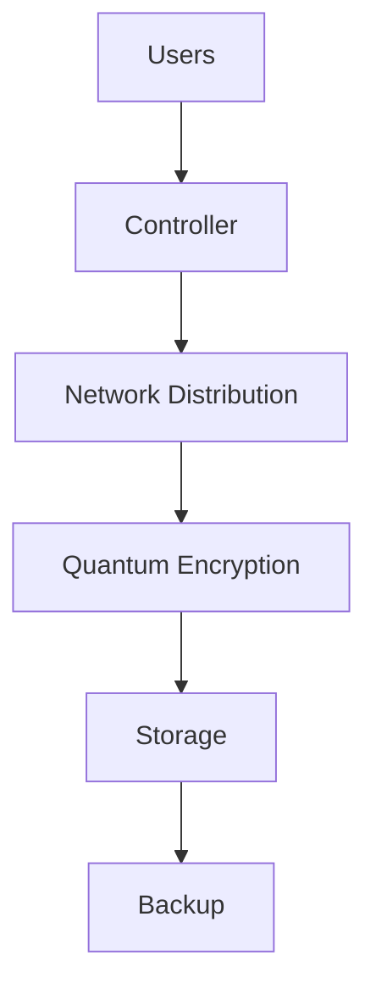

# AmanQ

## Quantum-Inspired Secure Distributed Infrastructure Platform
## Overview

AmanQ is a resilient distributed infrastructure platform designed to intelligently distribute network resources, secure files using quantum-inspired encryption techniques, and maintain distributed backups to ensure system reliability.

The system processes infrastructure resources through three main stages:

Network Distribution → Encryption → Distributed Backup

The goal is to build infrastructure capable of maintaining availability even in unstable environments.
## Core Innovation

AmanQ introduces three main innovations:

• Intelligent network distribution to optimize bandwidth usage  
• Quantum-inspired file encryption for security  
• Distributed backup system for resilience  

Unlike traditional systems, AmanQ focuses on infrastructure continuity rather than only computation.
## System Pipeline

The AmanQ processing pipeline works as follows:

User / Network Input  
        ↓  
Network Distribution Engine  
        ↓  
File Processing Layer  
        ↓  
Quantum-Inspired Encryption Engine  
        ↓  
Secure Storage  
        ↓  
Distributed Backup  
        ↓  
Recovery System
## System Architecture

