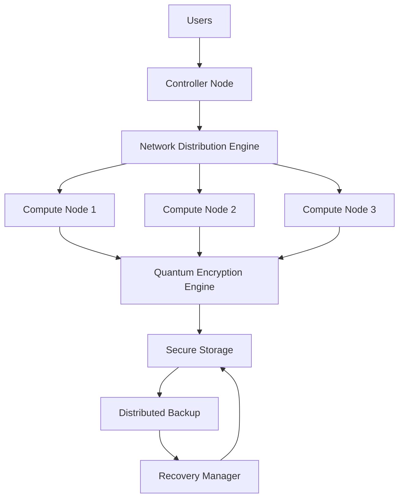
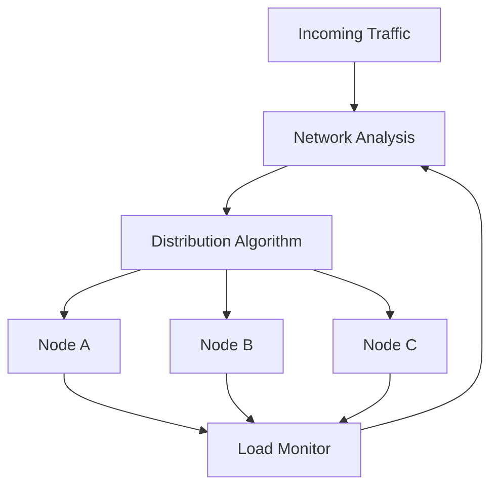
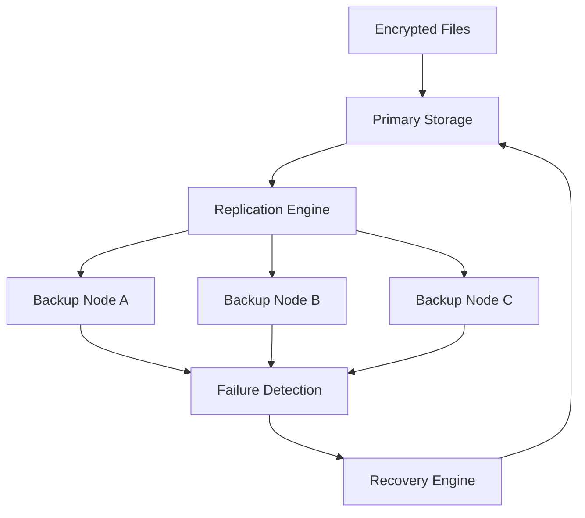

# AmanQ

## Quantum-Inspired Secure Distributed Infrastructure Platform

## Project Type

Distributed Infrastructure System  
Cybersecurity Engineering Project  
Resilient Computing Platform  

---

## Overview

AmanQ is a resilient distributed infrastructure platform designed to intelligently distribute network resources, secure files using quantum-inspired encryption techniques, and maintain distributed backups to ensure system reliability.

The system processes resources through three main stages:

**Network Distribution → Encryption → Distributed Backup**

The goal is to build infrastructure capable of maintaining availability even in unstable environments.

---

## Core Innovation

AmanQ introduces three main engineering innovations:

• Intelligent network distribution to optimize bandwidth usage  
• Quantum-inspired encryption to secure files  
• Distributed backup system for infrastructure resilience  

Unlike traditional systems, AmanQ focuses on **infrastructure continuity** rather than only computation.

---

## System Pipeline

The AmanQ processing pipeline:

Network Resources  
        ↓  
Network Distribution Engine  
        ↓  
File Processing  
        ↓  
Quantum-Inspired Encryption  
        ↓  
Secure Storage  
        ↓  
Distributed Backup  
        ↓  
Recovery System  

---

## System Architecture



---

## Processing Workflow


---

## Network Distribution Workflow



---

## Distributed Backup Architecture



---

## Core Modules

### Network Distribution Engine

Responsible for:

• bandwidth allocation  
• traffic balancing  
• node distribution  
• overload prevention  

Purpose:

Optimize network resource usage.

---

### Quantum Security Engine

Responsible for:

• file encryption  
• secure processing  
• data protection  

Purpose:

Protect data before storage.

---

### Distributed Backup Engine

Responsible for:

• file replication  
• redundancy storage  
• automatic backup  

Purpose:

Ensure files remain recoverable.

---

### Recovery Engine

Responsible for:

• system restore  
• failover handling  
• recovery operations  

Purpose:

Maintain infrastructure continuity.

---

## Technologies

Backend:

Node.js  
TypeScript  

Concepts:

Distributed Systems  
Cybersecurity  
Infrastructure Engineering  
Fault Tolerance  

Research Integration:

Quantum-Inspired Optimization  
AI Infrastructure Concepts  
Resilient Computing  

---

## Repository Structure

```
amanQ/

apps/          → applications

backend/       → core infrastructure

shared/        → utilities

docs/          → documentation

pic/           → architecture images

package.json

tsconfig.base.json
```

---

## Key Features

• Distributed infrastructure design  
• Secure file processing  
• Automatic backup system  
• Fault tolerance preparation  
• Modular architecture  
• Scalable backend design  

---

## Engineering Challenges Solved

AmanQ addresses:

• infrastructure instability  
• inefficient network usage  
• data loss risks  
• lack of redundancy  
• system downtime  
• resource allocation problems  

---

## Future Work

Infrastructure:

• dynamic node discovery  
• automatic failover  
• adaptive scaling  

Security:

• stronger encryption  
• secure communication  

AI:

• anomaly detection  
• predictive monitoring  

Interface:

• monitoring dashboard  
• analytics panel  

---

## Author

Engineering Project exploring:

Artificial Intelligence  
Distributed Systems  
Infrastructure Engineering  
Optimization Systems  

---

## License

Academic Research Project
